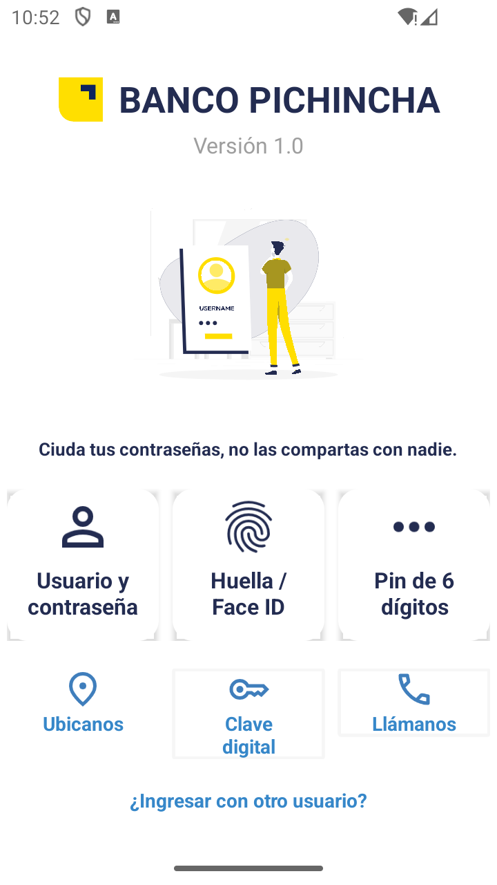

# Diseño Responsivo del Inicio de Sesión de una Aplicación Móvil
Uso de controladores basicos de Android Studio para el diseño Responsivo

## Aplicación finalizada

## Ejecución

[Ejecucion.webm](https://github.com/afreireo/semana4_loginResponsivo/assets/86501595/13a0bad4-0348-4295-ad5c-2a86cf775dc8)

